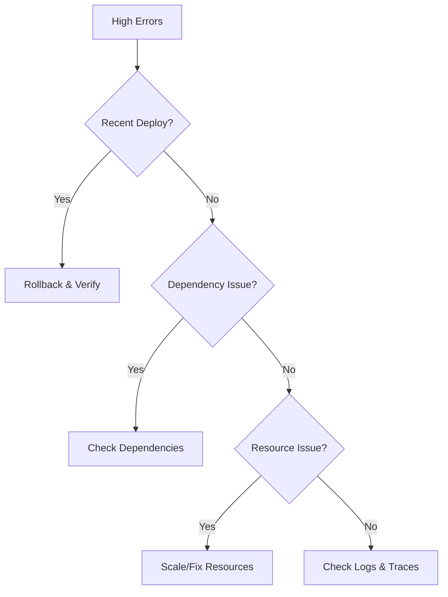

# Incident Diagnosis Skill

Systematic methodology for diagnosing production incidents, performing root cause analysis, and efficient triage.

## When to Use This Skill

- Production incident has been declared
- Customer-impacting issues reported
- Alerts firing requiring investigation
- Post-incident analysis needed
- Systematic troubleshooting required

## Incident Triage Framework

### 1. Assess Impact (First 2 Minutes)

**Key Questions:**
- What services/features are affected?
- How many users/customers impacted?
- Is there data loss or security risk?
- What is the blast radius?

**Quick Checks:**
```bash
# Service health
kubectl get pods -A | grep -v Running

# Recent deployments
kubectl rollout history deployment/<name>

# Active alerts
curl -s prometheus:9090/api/v1/alerts | jq '.data.alerts[] | select(.state=="firing")'
```

### 2. Identify Severity

| Severity | Criteria | Response |
|----------|----------|----------|
| **SEV1** | Complete outage, data loss, security breach | All hands, exec notification |
| **SEV2** | Major feature broken, significant user impact | Team mobilization, status page |
| **SEV3** | Partial degradation, workaround available | On-call investigation |
| **SEV4** | Minor issue, no immediate user impact | Normal ticket workflow |

### 3. Form Hypothesis

Based on symptoms, form initial hypotheses:

| Symptom | Likely Causes |
|---------|---------------|
| High error rate | Recent deploy, dependency failure, resource exhaustion |
| Increased latency | Database issues, network problems, resource contention |
| Partial outage | Single instance failure, region issue, load balancer |
| Complete outage | DNS, certificate, core dependency, widespread network |
| Data inconsistency | Replication lag, cache staleness, race condition |

## Diagnosis Workflows

### High Error Rate



**Steps:**
1. Check if recent deployment correlates with error spike
2. Verify external dependencies (databases, APIs, queues)
3. Check resource usage (CPU, memory, connections)
4. Analyze error logs for root cause

```bash
# Recent deploys
kubectl rollout history deployment/<name>

# Error logs
kubectl logs -l app=<name> --since=10m | grep -i error | head -50

# Dependency health
curl -s <dependency>/health
```

### High Latency

**Steps:**
1. Identify which service/endpoint is slow
2. Check database query performance
3. Look for resource contention
4. Check network latency between services

```bash
# Slow queries (if using slow query log)
kubectl exec <db-pod> -- cat /var/log/slow-query.log | tail -20

# Resource usage
kubectl top pods -n <namespace>

# Network latency
kubectl exec <pod> -- ping -c 3 <service>
```

### Service Unavailable

**Steps:**
1. Verify pods are running and ready
2. Check service endpoints
3. Verify ingress/load balancer
4. Check DNS resolution

```bash
# Pod status
kubectl get pods -l app=<name> -o wide

# Service endpoints
kubectl get endpoints <service>

# DNS check
kubectl run tmp --rm -i --tty --image=busybox -- nslookup <service>

# Ingress
kubectl describe ingress <name>
```

## Root Cause Analysis

### 5 Whys Technique

Ask "Why?" repeatedly until you reach the root cause:

1. Why did the service fail? → Pod OOMKilled
2. Why was pod OOMKilled? → Memory usage exceeded limit
3. Why did memory usage exceed limit? → Memory leak in new code
4. Why was there a memory leak? → Unclosed database connections
5. Why were connections unclosed? → Missing cleanup in error handler

**Root Cause:** Missing connection cleanup in error handling code.

### Timeline Reconstruction

Create a detailed timeline:

```
10:00 - Deploy v2.3.1 to production
10:05 - First error alerts fire
10:07 - Error rate reaches 5%
10:10 - On-call acknowledged, started investigation
10:15 - Identified correlation with deployment
10:18 - Initiated rollback to v2.3.0
10:22 - Rollback complete, errors decreasing
10:30 - Error rate back to baseline
```

### Contributing Factors

Document all contributing factors:

- **Immediate Cause:** What directly caused the incident
- **Contributing Factors:** What allowed it to happen
- **Detection Gap:** Why didn't we catch it sooner
- **Response Gap:** What slowed down resolution

## Investigation Tools

### Observability Stack

```bash
# Metrics (Prometheus)
curl 'prometheus:9090/api/v1/query?query=rate(http_requests_total{status=~"5.."}[5m])'

# Logs (Loki/ELK)
logcli query '{app="api"} |= "error"' --from="1h"

# Traces (Jaeger)
# Look for high latency spans, errors in traces
```

### Kubernetes Investigation

```bash
# Events
kubectl get events --sort-by='.lastTimestamp' -A

# Resource description
kubectl describe pod <pod>

# Previous container logs
kubectl logs <pod> --previous

# Exec for debugging
kubectl exec -it <pod> -- /bin/sh
```

### Database Investigation

```bash
# Connection count
psql -c "SELECT count(*) FROM pg_stat_activity;"

# Long-running queries
psql -c "SELECT pid, now() - query_start AS duration, query FROM pg_stat_activity WHERE state = 'active' ORDER BY duration DESC LIMIT 5;"

# Lock contention
psql -c "SELECT * FROM pg_locks WHERE NOT granted;"
```

## Common Anti-Patterns

### Don't Do These

1. **Jumping to conclusions** without data
2. **Making multiple changes** at once
3. **Not documenting** actions taken
4. **Working alone** on major incidents
5. **Ignoring "impossible" causes**
6. **Blaming individuals** (focus on systems)

### Do These Instead

1. **Gather data first** before hypothesizing
2. **One change at a time** and observe
3. **Document everything** in incident channel
4. **Communicate status** regularly
5. **Consider all possibilities**
6. **Focus on process improvements**

## Communication Templates

### Status Update

```
**Incident Update - [HH:MM] UTC**

**Status:** Investigating / Identified / Monitoring / Resolved

**Impact:** [Brief description of user impact]

**Current Finding:** [What we know so far]

**Next Steps:** [What we're doing next]

**ETA:** [If known]
```

### Escalation Request

```
Need assistance with [incident description]:

**Symptoms:** [What we're seeing]
**Affected:** [Services/users impacted]
**Tried:** [What we've attempted]
**Blocked on:** [Why we need help]

Can someone with [expertise] please join?
```

## Post-Incident

### Immediate Actions

1. Confirm service is stable
2. Document final timeline
3. Collect artifacts (logs, metrics, configs)
4. Schedule post-mortem within 48 hours
5. Create follow-up tickets

### Post-Mortem Template

```markdown
## Incident Summary
- **Date:**
- **Duration:**
- **Severity:**
- **Impact:**

## Timeline
[Detailed timeline of events]

## Root Cause
[What ultimately caused the incident]

## Contributing Factors
[What else contributed]

## Action Items
| Action | Owner | Due Date |
|--------|-------|----------|
| ... | ... | ... |

## Lessons Learned
[What we learned from this incident]
```

## Quick Reference

### Incident Checklist

- [ ] Acknowledge incident
- [ ] Assess impact and severity
- [ ] Start incident channel/bridge
- [ ] Assign roles (IC, Comms, Technical)
- [ ] Form initial hypothesis
- [ ] Gather data to confirm/refute
- [ ] Implement mitigation
- [ ] Verify resolution
- [ ] Communicate resolution
- [ ] Document for post-mortem

### Useful Commands

| Task | Command |
|------|---------|
| All pods status | `kubectl get pods -A -o wide` |
| Recent events | `kubectl get events --sort-by='.lastTimestamp'` |
| Error logs | `kubectl logs <pod> \| grep -i error` |
| Resource usage | `kubectl top pods` |
| Rollback | `kubectl rollout undo deployment/<name>` |
| Scale up | `kubectl scale deployment <name> --replicas=N` |
